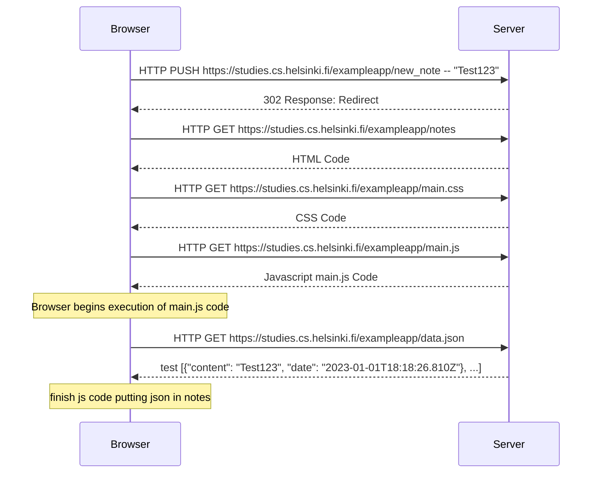
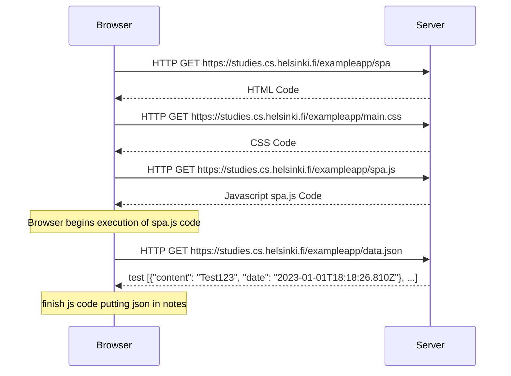
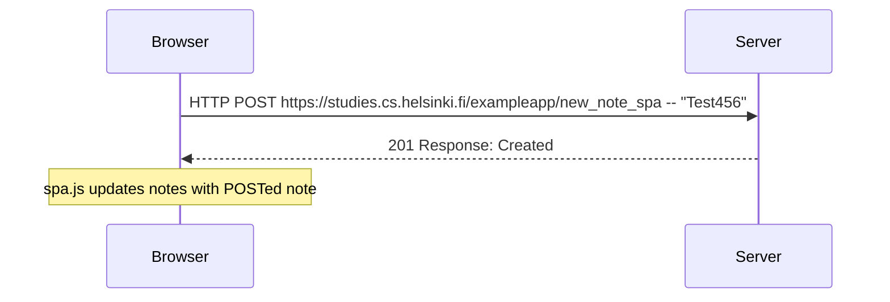

# Part 0 Diagrams

## New Note Diagram

```mermaid
sequenceDiagram
Browser->>Server: HTTP PUSH https://studies.cs.helsinki.fi/exampleapp/new_note -- "Test123"
Server-->>Browser: 302 Response: Redirect 
Browser->>Server: HTTP GET https://studies.cs.helsinki.fi/exampleapp/notes
Server-->>Browser: HTML Code
Browser->>Server: HTTP GET https://studies.cs.helsinki.fi/exampleapp/main.css
Server-->>Browser: CSS Code
Browser->>Server: HTTP GET https://studies.cs.helsinki.fi/exampleapp/main.js
Server-->>Browser: Javascript main.js Code
Note over Browser: Browser begins execution of main.js code
Browser->>Server: HTTP GET https://studies.cs.helsinki.fi/exampleapp/data.json
Server-->>Browser: test [{"content": "Test123", "date": "2023-01-01T18:18:26.810Z"}, ...]
Note over Browser: finish js code putting json in notes
```

## SPA Diagram

```mermaid
sequenceDiagram
Browser->>Server: HTTP GET https://studies.cs.helsinki.fi/exampleapp/spa
Server-->>Browser: HTML Code
Browser->>Server: HTTP GET https://studies.cs.helsinki.fi/exampleapp/main.css
Server-->>Browser: CSS Code
Browser->>Server: HTTP GET https://studies.cs.helsinki.fi/exampleapp/spa.js
Server-->>Browser: Javascript spa.js Code
Note over Browser: Browser begins execution of spa.js code
Browser->>Server: HTTP GET https://studies.cs.helsinki.fi/exampleapp/data.json
Server-->>Browser: test [{"content": "Test123", "date": "2023-01-01T18:18:26.810Z"}, ...]
Note over Browser: finish js code putting json in notes
```

## New Note SPA Diagram

```mermaid
sequenceDiagram
Browser->>Server: HTTP POST https://studies.cs.helsinki.fi/exampleapp/new_note_spa -- "Test456"
Server-->>Browser: 201 Response: Created
Note over Browser: spa.js updates notes with POSTed note

```
